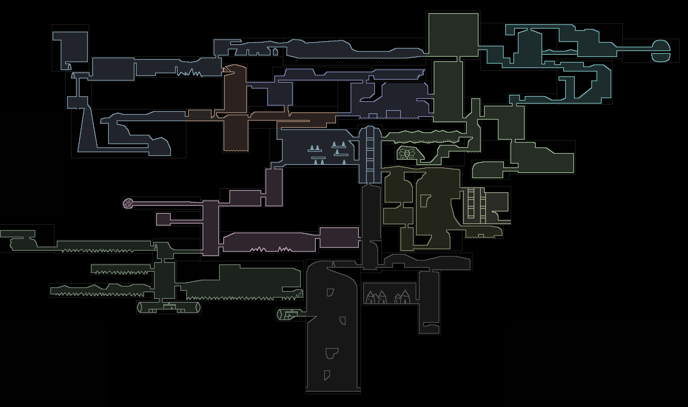

## Hallowdale

An homage to Hollow Knight.




[itch.io page](https://mega-dean.itch.io/hallowdale)

### Instructions

1. Either clone the repo from github, or download and unzip the game from itch.io
2. Run the executable in `dist/` for your operating system

### Game modes

#### Classic

This is like normal Hollow Knight gameplay, and has cutscenes that follow the episode "Geothermal
Escapism". It is disabled until the map can be updated to handle both game modes (currently it's
just a bunch of purple pen jars everywhere).

#### Steel Sole

This is like a "New Game +" mode where you start with all abilities, but standing on any floor will
cause a hazard respawn (although you can land in water/acid safely). Cutscenes are disabled and
abilities/lore are removed, so the only objective is to collect all 100 purple pens.

C-dashing makes this game mode much easier, so for an additional challenge you can try to traverse
the map without them. All of the purple pens can be collected without using them, except for some in
the Computer Wing area, so c-dashes that are started in that area aren't counted.

### Configuration

There is currently no menu for rebinding keys, but they can be overridden by placing a file at
`config/keybinds.json` and restarting the game. See `config/keybinds.json.example` for an example.

Only keyboard input is supported, but gamepad support will be added once I get a gamepad to test with.

None of the other settings (like fps) are configurable yet.

### Development

#### Setup

1. install `opam`
2. use `opam` to install `ocaml` version 4.13
3. use `opam` to install dependencies: `opam install dune yojson atdgen raylib ppx_expect ocamlformat`

#### Scripts

##### build and run

```
dune exec hallowdale
```

##### run tests

```
dune runtest
```

##### promote test output

```
dune promote
```

##### regenerate and replace .atd

```
rm src/json_* && atdgen -t src/json.atd && atdgen -j src/json.atd
```

##### create release

Trigger the github actions manually.

### License

[MIT for the code, CC BY_NC 4.0 for the assets](LICENSE.md)

- Most of the assets were taken from the [original Journey to the Center of Hawkthorne game](https://github.com/hawkthorne/hawkthorne-journey/tree/master/src/images), with some modifications made.

### Acknowledgements

- creators of original Hawkthorne game
- creators of Hollow Knight
- creators of Community
