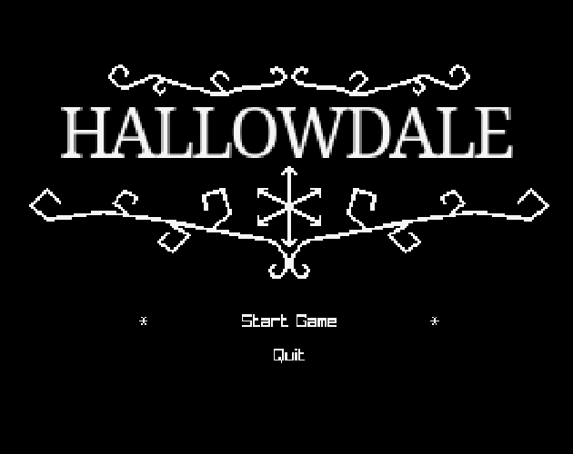
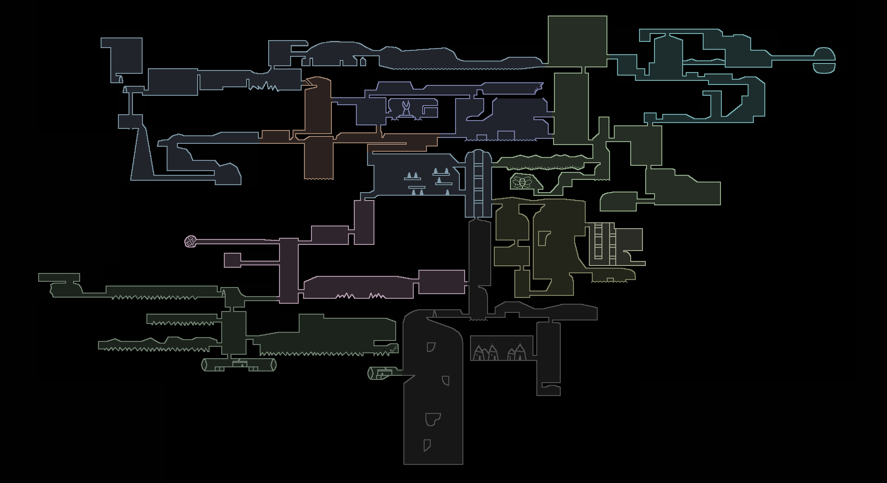

## Hallowdale

An homage to Hollow Knight.

[itch.io page](https://mega-dean.itch.io/hallowdale)





### Release Versions

The versions are not using semantic versioning, even though it is the same format:

- v0.0.\_ -> unstable/demo/pre-release, mostly for testing, major bugs are expected
- v0.\_.\_ -> these should be stable and playable out-of-the-box but with content missing, bugs are expected
- v1.\_.\_ -> released

### Instructions

Either use the github release or download from https://mega-dean.itch.io/hallowdale .

#### Linux

This is built on Ubuntu and has been tested on Pop!_OS, so it probably works on most Debian-based
distributions. It may work on other distributions that have OpenGL installed since it depends on
Raylib, but I haven't tested this.

#### MacOS

I've tested on an M1 Macbook Air and it works, but it's not great (sluggish controls, jittery, audio
clipping).

The executable isn't notarized by Apple so it can't be run directly. After
attempting to run it and dismissing the "this may be malware" warning, you can go to the Security
page in System Preferences to whitelist it specifically.

#### Windows

Untested - please create an Issue if you run into any problems.

### Game modes

#### Classic

This is like normal Hollow Knight gameplay, and has cutscenes that follow the episode "Geothermal
Escapism". This game mode is disabled until the map can be updated to handle both game modes.

#### Steel Sole

This is a "New Game +" mode where you start with all abilities, but standing on any floor will
cause a hazard respawn (although you can land in water/acid safely). Cutscenes are disabled and
abilities/lore are removed, so the only objective is to collect all 120 purple pens.

C-dashing makes this game mode much easier, so for an additional challenge you can try to traverse
the map without them. All of the purple pens can be collected without using them, except for some in
the Computer Wing area, so c-dashes that are started in that area are allowed and not counted towards
the total.

#### Demo

This is a "New Game +" mode like Steel Sole but without the damage respawns, so you can play this if
you just want to run around the map and find the purple pens.

### Configuration

There is currently no menu for rebinding keys, but they can be overridden by placing a file at
`config/key_overrides.json` and restarting the game. Gamepad buttons can be rebound with a file at
`config/button_overrides.json`, using button names for a Playstation controller. See
`config/key_overrides.json.example` and `config/button_overrides.json.example` for examples.

None of the other settings (like fps) are configurable yet.

### Controls

Most of the controls match the default Hollow Knight controls, but there are a few differences:

- no Inventory button yet
- additional Interact button, instead of pressing up/down
- cannot tap Focus to cast

#### Keyboard

- Jump - Z
- Attack - X
- Dash - C
- Focus - A
- C-dash - S
- Dream nail - D
- Quick cast - F
- Interact - left shift
- Open map - tab
- Pause - Escape
- Movement - arrow keys

#### Gamepad

- Jump - x
- Attack - square
- Dash - R2
- Focus - R1
- C-dash - L2
- Dream nail - triangle
- Quick cast - circle
- Interact - L1
- Open map - select
- Pause - start
- Movement - d-pad or left stick (although the stick doesn't work for menus because of a bug)

### Development

#### Setup

1. install `opam`
2. use `opam` to install `ocaml` version 5.1: `opam switch create 5.1.0`
3. use `opam` to install dependencies: `opam install --deps-only .`
4. use `opam` to install dev dependencies: `opam install ocamlformat merlin ocp-indent down omod landmarks landmarks-ppx`

#### Scripts

##### build and run

```
dune exec hallowdale
```

##### regenerate and replace .atd

```
rm src/json_* && atdgen -t src/json.atd && atdgen -j src/json.atd
```

### License

[MIT for the code, CC BY_NC 4.0 for the assets](LICENSE.md)

- Most of the assets were taken from the [original Journey to the Center of Hawkthorne game](https://github.com/hawkthorne/hawkthorne-journey/tree/master/src/images), with some modifications made.

### Acknowledgements

- creators of original Hawkthorne game
- creators of Hollow Knight
- creators of Community
